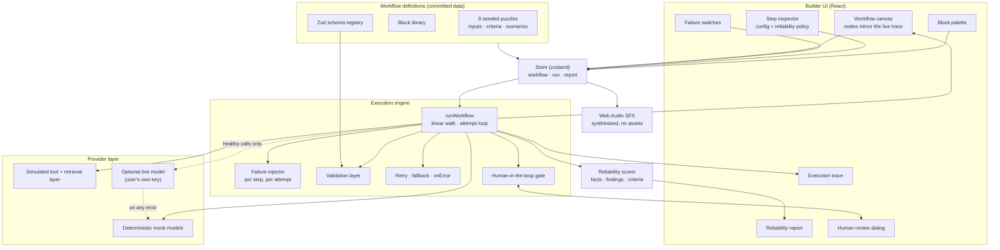

# AI Workflow Puzzle Builder

An interactive puzzle lab for learning how reliable AI workflows are designed.

You are handed a workflow that is already broken, or worse, one that reports success while producing something nobody should act on. You run it, watch where it comes apart, and repair it with retries, fallbacks, validators, conditions and human approval. When it finishes you get a reliability report that tells you which of your choices actually did the work.

Everything runs locally on deterministic mocks. **No API key is required, no paid service is involved, and nothing calls the network unless you explicitly connect your own model.**

---

## Try it without installing anything

**Live build: <https://workflow-puzzle-lab.pages.dev>**

Static hosting, the exact `dist/` produced by `npm run build` from this source. It is offered purely as a convenience for reviewing; the app is designed to run locally and the instructions below are the supported path.

---

## Quick start

Requires Node.js 18 or newer.

```bash
npm install
npm run dev
```

Open the URL Vite prints, usually <http://localhost:5173>. That is the whole setup. There is no `.env` file, no key to paste, no account to create.

| Command | What it does |
| --- | --- |
| `npm run dev` | Development server with hot reload |
| `npm run build` | Type checks then builds to `dist/` |
| `npm run preview` | Serves the production build |
| `npm test` | Runs the test suite (47 tests) |

### Try it in sixty seconds

1. The app opens on **Fix the Meeting Summarizer**.
2. Press **Run workflow**. It succeeds.
3. Open the **Report** tab. The workflow is not solved, and the reason is that the output is invalid: the model returned action items with nobody's name on them, and nothing checked.
4. Click the **Summarise the meeting** node, then add a **Transform** block and set it to *Assign unowned tasks*, then add a **Validator** block set to *Meeting summary*.
5. Run it again. Solved.

That loop is the entire product.

---

## The eight puzzles

Six of the eight require you to handle or recover from a failure. Between them they cover seven of the nine failure kinds the simulator supports.

| # | Puzzle | Level | The lesson |
| --- | --- | --- | --- |
| 1 | Fix the Meeting Summarizer | Beginner | A workflow that finishes is not the same as a workflow that worked |
| 2 | Ground the Knowledge Assistant | Beginner | An empty retrieval result is a valid response, and a dangerous one |
| 3 | Repair the Ticket Router | Intermediate | When a fault is not transient, retrying is just failing more slowly |
| 4 | Survive the Research Timeout | Intermediate | A transient fault is the cheapest class of failure to survive |
| 5 | Approve Before Sending | Intermediate | An approval gate after the irreversible action is theatre |
| 6 | Validate the Data Extractor | Advanced | Right values, wrong types: repair the output rather than re-asking |
| 7 | Activate the Fallback | Advanced | A dead provider needs somewhere else to go, not more attempts |
| 8 | Resume the Interrupted Mission | Advanced | Two faults of different kinds need two different tools |

Each puzzle ships with a title, difficulty, objective, the blocks it unlocks, a committed sample input, the expected result, its failure scenarios and machine checkable completion criteria. Nothing is generated at runtime.

**Hints** are revealed one at a time from the left panel. The first nudges you towards noticing the problem; the last names the fix.

---

## Using the workflow builder

The canvas shows the workflow as a vertical chain. Execution really is linear, so a canvas where node position carried no meaning would be lying to you. Pan, zoom and fit-to-view all work.

| Action | How |
| --- | --- |
| Select a step | Click the node. It opens in the **Inspector** on the right |
| Add a block | Click any block in the **Add a block** palette. It is inserted after your selection, or just before the output step |
| Reorder a step | Hover the node and use the ↑ ↓ arrows |
| Remove a step | Hover the node and use ✕ |
| Configure a step | Select it and edit the Inspector |

The input and output steps are fixed: they cannot be moved or deleted, because the chain needs both ends.

Only the blocks a given puzzle needs are offered. Handing you the full library on every puzzle would turn a focused exercise into a search.

### The block library

**Core blocks** — Input, AI Model, Tool / API, Retrieval, Condition, Transform, Output
**Reliability blocks** — Validator, Safe Stop
**Human control blocks** — Human Review, Confidence Check

Retry, timeout and fallback are not separate blocks. They are part of a step's **reliability policy**, edited in the bottom half of the Inspector, and shown as chips on the node. That is the point being taught: the policy is not something bolted onto a step afterwards, it is half of the step's definition.

---

## How failure simulation works

Failure scenarios are listed in the left panel with a switch each. Every scenario declares:

- **which kind** of failure it is,
- **which step** it is injected into,
- **which attempts** it breaks, 1-indexed.

That last part is what makes the puzzles teach something. A scenario that fails on attempts `[1, 2]` is transient, and a three-attempt retry policy visibly rescues it. A scenario that fails on *every* attempt is not transient, and no amount of retrying will help, so you need a fallback or an honest safe stop.

Nothing is random. The same switches and the same configuration produce the same trace every time, so any run can be reproduced exactly.

### The nine failure kinds

| Kind | Behaviour | What survives it |
| --- | --- | --- |
| `modelTimeout` | The model call throws | Retry, or a fallback model |
| `toolTimeout` | The tool call throws | Retry, or a fallback source |
| `toolError` | The tool returns HTTP 503 | Retry, or a fallback source |
| `invalidJson` | The model returns prose that will not parse | Retry, or the strict fallback model |
| `missingField` | A required field is quietly dropped, **no exception** | A validator, then a transform |
| `schemaViolation` | Values parse but break the schema's rules | Enforcing a schema on the step, then a fallback |
| `emptyRetrieval` | Retrieval succeeds with zero documents, **no exception** | A condition that guards the model |
| `lowConfidence` | A confident-sounding answer with a low score | A confidence check routing to a human |
| `rejectedByHuman` | Pre-selects Reject in the review dialog | Correct step ordering |

The two marked **no exception** are the important ones. They do not crash. They travel quietly downstream and produce a run that looks entirely successful, which is exactly why the first two puzzles are built around them.

A scenario can also be marked `exemptFallback`, which means the failure is never injected into a fallback attempt. That models the ordinary case where one provider is down and another is not.

---

## How retry and fallback work

When a fallible step runs, the engine loops:

```
for attempt in 1 .. maxAttempts:
    call the primary provider
    if the step declares a schema, validate the output here
    success -> done
    failure -> record the attempt and continue

if every attempt failed and a fallback is configured:
    make one more attempt against the fallback provider

if that failed too:
    apply the step's onError policy
```

Three things follow from this shape, and all three are deliberate:

**An AI step that declares a schema validates its own output inside the attempt loop.** An invalid response counts as a failed attempt, so a retry or a fallback model can rescue schema drift. This is how real structured-output pipelines work. Leave the schema unset and bad output travels downstream instead, which is the mistake several puzzles ask you to notice.

**A fallback is tried exactly once, after everything else.** It is the answer to "the provider is down", not to "the provider is flaky".

**`onError` decides what happens when everything has failed.** The options are `fail`, `safeStop`, `humanReview` and `useDefault`. A workflow that stops safely scores better than one that emits a result nobody can trust.

The three mock models exist to make fallback meaningful: `mock-fast` is quick and formats sloppily, `mock-balanced` is the default, and `mock-strict` is slower but returns schema-clean output, which makes it the natural fallback.

---

## How validation and human review work

### Validation

Eight schemas are registered, each defined once as a Zod object and used for both checking and self-description; the Inspector renders a schema's fields as a table so you can see what you are enforcing.

A **Validator** block checks whatever arrives at that point in the chain. It can *enforce* (a failure stops the payload) or *warn only* (record it and carry on). Validation issues are flattened into plain sentences, because the audience is someone learning workflow design, not someone reading a stack trace.

One schema is worth calling out. `groundedAnswer` carries a cross-field rule: if `answered` is true then `citations` must not be empty. Every field passes on its own while the object as a whole describes an assistant that answered confidently with no evidence behind it. That is the shape of most real grounding bugs.

### Human review

A **Human Review** block genuinely pauses the run. The engine is awaiting a promise that the dialog resolves, so the workflow is stopped, not merely displaying something.

The reviewer can **approve**, **edit** the payload, or **reject**. Approving stamps the reviewer onto the payload as `approvedBy`, so the decision is auditable afterwards. Rejecting stops the workflow safely, and the reliability report counts that as a strength rather than a failure, because the unsafe action never happened.

A **Confidence Check** block routes low-confidence results away from the happy path, to a human, to a marked-degraded path, or to a safe stop.

---

## Mock AI mode

This is the default and it is what every puzzle is designed, graded and tested against.

`src/providers/mockModel.ts` holds a bank of canned responses keyed by response family, plus deliberately corrupted variants of each. The corruptions are modelled on how models actually misbehave: a fenced code block that is not valid JSON, a required field silently dropped, an enum value invented on the spot, a number returned as `"$4,820.50"`, and a confident answer with nothing behind it.

`src/providers/tools.ts` does the same for six simulated external services, each with a documented failure mode.

Every mock response is deterministic. No network, no key, no cost, and no run that cannot be reproduced.

The header shows **● mock AI mode** whenever this is what is running.

---

## Configuring an optional AI provider

Entirely optional. The app is complete without it.

Click the **● mock AI mode** button in the header and choose either:

- **Google Gemini** — has a free tier. Default model `gemini-2.0-flash`.
- **OpenAI-compatible endpoint** — anything speaking the chat completions API, including a local server such as Ollama or LM Studio, so this path can also be used with no cloud account at all.

Your key is kept in that browser's `localStorage` and sent only to the endpoint you chose. There is no server in this project for it to reach.

Two rules keep this from undermining the puzzles:

1. **A step with a failure injected into it always uses the mock.** You cannot ask a real model to time out on cue, and a puzzle that behaved differently run to run would stop being a puzzle. Live calls replace the healthy path only.
2. **Any live failure falls back to the mock for that call**, and the trace says so. A bad key or a dropped connection degrades the experience; it never breaks it.

---

## Architecture



A rendered copy lives at [`docs/architecture.svg`](docs/architecture.svg), and [`docs/ARCHITECTURE.md`](docs/ARCHITECTURE.md) walks through the same picture in prose.

### Source layout

```
src/
  engine/
    types.ts          Domain model. Read this first
    blocks.ts         Block catalogue: labels, colours, defaults, teaching notes
    executor.ts       runWorkflow: the linear walk and the attempt loop
    validators.ts     Zod schema registry and plain-language issue reporting
    transforms.ts     Pure, total repair functions
    reliability.ts    Facts, findings, score and completion criteria
    __tests__/        The suite described below
  providers/
    mockModel.ts      Deterministic model responses, healthy and corrupted
    tools.ts          Six simulated services with documented failure modes
    liveModel.ts      Optional live provider, never required
  puzzles/
    beginner.ts       Puzzles 1-2
    intermediate.ts   Puzzles 3-5
    advanced.ts       Puzzles 6-8
    index.ts          The set, plus helpers
  ui/                 One component per responsibility
  audio/sfx.ts        Sound effects synthesised at runtime
  styles/             Design tokens, canvas, panels
  store.ts            Application state
```

### Assumptions

- **Execution is linear.** `condition` steps skip forward rather than branching into sub-graphs. This keeps the trace readable, and the trace is the product. It covers every puzzle scenario without turning the engine into a general orchestration platform.
- **Simulated latency, not real latency.** Timeouts compare a step's configured `timeoutMs` against a provider's nominal latency. This is what makes a timeout reproducible.
- **Progress is session-scoped.** Solved puzzles are remembered until reload. This is a lab, not a course with an account behind it.
- **A single dark theme,** committed to deliberately rather than half-supporting two.
- **No audio assets.** Every sound is generated from oscillators at runtime, so the bundle stays small, the app works offline, and no asset licence is involved.

---

## Testing

```bash
npm test
```

47 tests. The suite enforces the contract that matters most for a teaching product, for **all eight puzzles**:

1. **Every puzzle is genuinely broken as shipped.** If a starting workflow already met its own completion criteria, the puzzle would be a lie.
2. **Every puzzle is genuinely solvable, by exactly the fix its own hints describe.** The solutions in the suite are written the way a learner performs them in the UI: insert a block, reorder a step, change a policy field. If the hints and the engine ever drift apart, this fails.
3. **Every executed step produces a trace entry**, and none is left in a running state.
4. **Runs are deterministic.** The same configuration twice produces the same status, score and final output.
5. **Nothing breaks with the failures switched off.**

Plus set-level assertions: eight puzzles across three levels, at least four distinct failure kinds, at least three puzzles requiring recovery, at least one requiring structured-output validation, at least one recording a human decision, and every failure scenario targeting a step that actually exists.

The app was additionally driven end to end in a real browser (Chromium via Playwright): loading, running a puzzle unsolved, solving it entirely through the UI, the human review pause, editing and rejecting, step reordering, the optional provider dialog, all eight puzzles rendering, layout down to 420px wide, and a check that the console stays clean. 19 checks, all passing.

---

## Demo

**Watch a full walkthrough: <https://youtu.be/6KMcPU4nb6s>** (5 minutes)

It covers picking a puzzle, running a workflow that succeeds while producing invalid output, reading the trace, repairing the design, triggering a controlled failure, watching a retry and a fallback, validating structured output, approving and rejecting at a human review step, and the reliability report.

---

## Known limitations

- **Branching is forward-skip only.** A `condition` skips N following steps rather than opening a parallel branch that rejoins. It is enough for every scenario here and it keeps the trace linear and readable, but it is not a general DAG.
- **Retrieval merges into one document pool.** Two retrieval steps append to the same `documents` array rather than keeping separately addressable result sets.
- **Resume-from-checkpoint is modelled, not implemented.** Puzzle 8 teaches the pattern using a checkpoint store and a transform. The engine does not persist a partial run across a page reload and pick it up later.
- **Latency is nominal.** Providers declare a fixed latency rather than varying it, which is what makes timeouts reproducible, but it does mean timeout behaviour is a simulation.
- **The live provider path is browser-direct.** Calling a model API from the browser with a user-supplied key is right for a local learning tool and wrong for production, where the key belongs behind a server. Some endpoints will also refuse cross-origin requests; when that happens the app falls back to the mock and says so.
- **Progress is not persisted.** Solved puzzles reset on reload. Only the optional provider setting is stored.
- **Sound is synthesised**, so it is functional rather than designed. It marks state changes; it is not a score. Mute is in the header.
