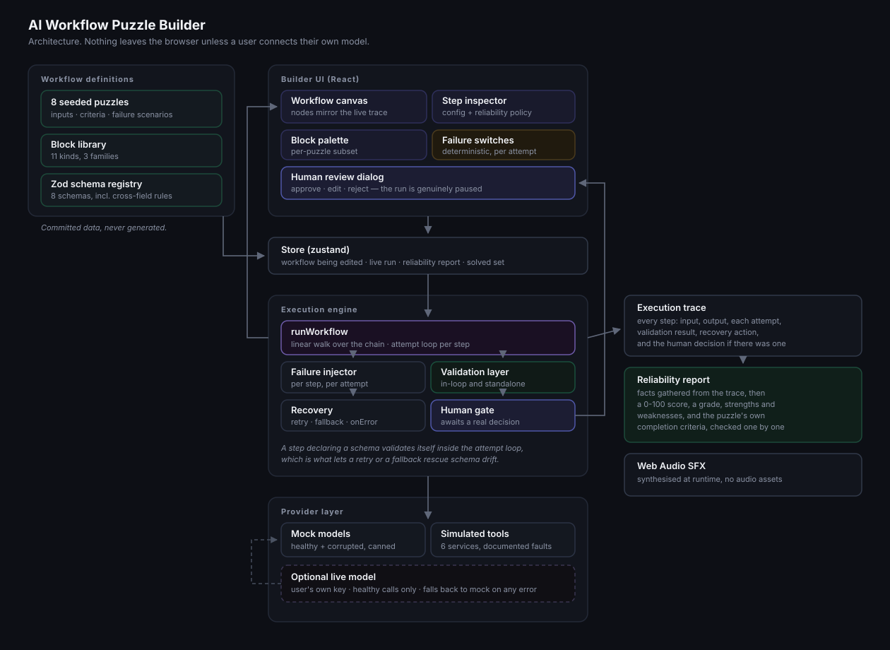

# Architecture



The README covers what the app does. This document covers how a run actually executes, and why the pieces are shaped the way they are.

---

## The shape of the system

Four layers, each of which can be understood without the others:

| Layer | Knows about | Does not know about |
| --- | --- | --- |
| **Definitions** (`src/puzzles`, `blocks.ts`, `validators.ts`) | Data only | Execution, React |
| **Engine** (`src/engine`) | Definitions, providers | React, the DOM |
| **Providers** (`src/providers`) | Nothing but their own request shape | Workflows, puzzles |
| **UI** (`src/ui`, `store.ts`) | Everything below it | Nothing depends on it |

The engine has no React import anywhere, which is what allows the test suite to run all eight puzzles headlessly at `speed: 0` in under 40 milliseconds. If that dependency ever reverses, the tests are the first thing that will break.

---

## Walking one run

`runWorkflow(workflow, input, scenarios, options)` walks the chain from index 0. For each step:

### 1. Is this step being skipped?

An earlier `condition` may have set a skip counter. If so the step gets a trace entry with status `skipped` and the walk moves on. Skipped steps are recorded rather than omitted, because "the model never ran, and here is why" is exactly what puzzle 2 is teaching.

### 2. Run the step

Steps fall into three groups:

- **Free steps** (`input`, `output`, `transform`, `safeStop`, `condition`, `confidenceCheck`) cannot fail. They compute and return.
- **The human step** pauses. The engine awaits a promise that the UI resolves when someone clicks. The run is genuinely stopped, not merely showing a dialog.
- **Fallible steps** (`ai`, `tool`, `retrieval`, `validator`) enter the attempt loop.

### 3. The attempt loop

```
totalAttempts = maxAttempts + (fallback configured ? 1 : 0)

for attempt in 1 .. totalAttempts:
    usingFallback = attempt > maxAttempts
    injected      = failureFor(step, attempt, usingFallback)

    call the provider with `injected`
    if the step declares a schema:
        validate here; invalid counts as a failed attempt

    success -> record attempt, return
    failure -> record attempt, continue
```

Every attempt is appended to the trace with its own error, duration and whether it used the fallback. That per-attempt record is what makes the difference between retry and fallback visible in the UI rather than merely asserted.

### 4. When everything has failed

The step's `onError` policy decides:

| Policy | Outcome |
| --- | --- |
| `fail` | The run stops with status `failed`. This is an unhandled error and the score is penalised for it |
| `safeStop` | The run stops with status `safelyStopped`, carrying a reason |
| `humanReview` | A person is asked what to do, and their decision is recorded |
| `useDefault` | A configured value is substituted and the walk continues |

### 5. Publish

After every state change the engine calls `onUpdate` with a shallow copy. The store pushes that into React, the canvas recolours the node it belongs to, and the sound layer compares it against the previous state to decide whether a retry, a fallback or a pause just happened. This is why the canvas animates during a run instead of jumping to a final answer.

---

## Three decisions worth explaining

### Execution is linear

`condition` steps skip forward by N rather than opening a branch that later rejoins. A general DAG would be more powerful and would make the trace much harder to read, and the trace is the product. Every scenario in the puzzle set is expressible with forward-skip.

### Failures are injected per attempt

A scenario declares `failOnAttempts`. `[1, 2]` means the first two attempts fail and the third succeeds, which is what makes a three-attempt retry policy visibly worth configuring. An empty array means every attempt fails, so retrying is pointless and the learner has to reach for a fallback or an honest safe stop.

`exemptFallback` marks a scenario as never applying to a fallback attempt. Without it, an "always fails" scenario would also take out the fallback, and no amount of good design could rescue the run, which teaches nothing.

### An AI step can police its own output

Setting `schemaId` on an `ai` step moves validation *inside* the attempt loop. An invalid response is a failed attempt, so a retry or a fallback model can rescue schema drift, exactly as a real structured-output pipeline does.

A standalone `validator` block still exists for checking payloads further down the chain, where re-requesting would not help. Puzzle 3 teaches the first; puzzle 6 teaches the second. The distinction between them is the single most useful idea in the app.

---

## Scoring

`buildReliabilityReport` does three things in order.

**Gather facts** from the trace: retries spent, whether a fallback completed, validators run, validation failures caught, human decisions, unhandled errors, guards that diverted the run, and whether the workflow *coped* — meaning it ended succeeded or safely stopped with nothing left broken.

**Build findings**, each one tied to a specific behaviour rather than to the score. Strengths and weaknesses are both listed, because a learner needs to know which of their choices did the work, not only what is still missing.

**Score and grade.** The weighting is deliberate:

- Producing a valid result scores highest, and stopping safely scores nearly as well. Finishing with an invalid output scores worst of the three, because it is the outcome that looks like success.
- Coping with an injected fault is worth more than any single defensive habit.
- Avoiding a fault by design earns the same credit as recovering from one. A workflow that notices an empty shelf and never calls the model has not failed to recover; it has made the failure impossible.
- Each unhandled error costs more than any single good habit earns.

Separately, the puzzle's own `completionCriteria` are checked one by one. The score is advice; the criteria are the pass mark. They are deliberately different things, and a run can score 74 while still leaving a criterion unmet.

---

## Testing strategy

The suite in `src/engine/__tests__/puzzles.test.ts` asserts a two-sided contract for every puzzle: it must be **unsolved as shipped**, and **solved by the exact fix its own hints describe**. The solutions are written the way a learner performs them, through the same insert, reorder and configure operations the UI exposes.

That pairing is what keeps the content honest. If a puzzle is accidentally made trivial, the first assertion fails. If the engine changes so a documented fix stops working, the second fails. Either way the hints and the engine cannot silently drift apart.
